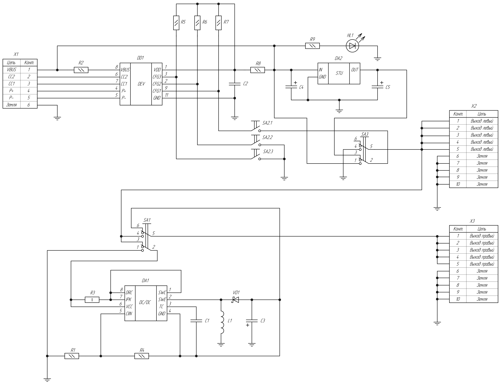

  <a href="README.md">Русский</a> | <a href="README.en.md">English</a> | <b>Deutsch</b>

# Funktionsbeschreibung des Schaltungsentwurfs des kombinierten Stromversorgungsmoduls

Dieses Dokument enthält eine detaillierte technische Beschreibung der Funktionsweise des elektrischen Schaltplans für das "Kombinierte Stromversorgungsmodul für lötfreie Steckplatinen (Breadboards) mit QC/PD-Unterstützung".

  

## 1. Verwendungszweck und Gesamtarchitektur

Das Gerät ist dafür ausgelegt, lötfreie Steckplatinen während des Prototyping und des Debugging von elektronischen Geräten mit einer stabilen mehrkanaligen Stromversorgung zu versorgen. Das Modul wandelt die Eingangsspannung eines externen Ladegeräts oder einer externen Powerbank, die Schnellladeprotokolle unterstützen, in einen Satz stabilisierter Spannungen um:
* **Schnellladekanal (VBUS):** einstellbare Spannung von $5\text{ V}$, $9\text{ V}$, $12\text{ V}$, $15\text{ V}$ oder $20\text{ V}$ (wird durch die Trigger-Anforderung bestimmt).
* **Niederspannungskanal für Logikversorgung:** feste Spannung von $+3{,}3\text{ V}$.
* **Negativer Spannungskanal (symmetrische Spannungsversorgung):** feste Spannung von $-15\text{ V}$.

---

## 2. Funktionsweise der einzelnen Baugruppen

Der elektrische Schaltplan des Geräts besteht aus fünf miteinander verbundenen Hauptblöcken:

### 2.1. USB Type-C Eingangsstufe
Der Betrieb des Moduls beginnt mit dem Anlegen einer externen Stromversorgung an den Anschluss **`X1`** (Typ *TYPEC-304-ACP16*). 
* Die Kontakte `A4/B9` und `B4/A9` sind zu einer gemeinsamen Eingangsstromschiene **`VBUS`** zusammengefasst.
* Die Kontakte `A1/B12` und `B1/A12` sind mit der Systemmasse **`GND`** verbunden.
* Die Kanalkonfigurationskontakte `CC1` und `CC2` sind zum Schnelllade-Trigger herausgeführt, um die Aushandlung mit der Stromquelle durchzuführen.
* Die LED **`VD2`** (mit dem Strombegrenzungswiderstand `R10` von $1\text{ k}\Omega$) dient zur visuellen Anzeige der Eingangsspannung auf der `VBUS`-Schiene.

### 2.2. Aushandlungseinheit für Schnellladeprotokolle (QC/PD)
Das Schlüsselelement für die Kommunikation mit dem Netzteil ist der Trigger-IC **`DD1`** vom Typ **`CH224K`**. Er unterstützt hardwareseitig die Protokolle USB Power Delivery (PD3.0/2.0), Quick Charge (QC3.0/2.0) und andere.
* Die Signalleitungen `DP` (D+) und `DM` (D-) sowie die Konfigurationsleitungen `CC1` und `CC2` sind direkt mit den entsprechenden Pins von `DD1` verbunden.
* Die Betriebslogik des Triggers wird durch den Zustand seiner Konfigurationseingänge `CFG1`, `CFG2` und `CFG3` bestimmt. Diese Eingänge werden durch die Widerstände `R5`, `R6`, `R7` von $10\text{ k}\Omega$ auf die interne Versorgungsschiene `VDD` hochgezogen (pull-up) und über einen dreistufigen DIP-Schalter **`SA2`** (*DS1040-03RN*) gesteuert.
* Durch Schließen der entsprechenden Kontakte des Schalters `SA2` gegen Masse (`GND`) stellt der Benutzer manuell den gewünschten Spannungspegel (von $5\text{ V}$ bis $20\text{ V}$) ein.

### 2.3. LDO-Linearreglerstufe ($+3{,}3\text{ V}$)
Für die zuverlässige Stromversorgung von Mikrocontrollern und digitalen Sensoren wird ein leistungsstarker Linearregler mit geringem Spannungsabfall (LDO) **`DA2`** vom Typ **`LD1086DT33TR`** (im TO-252-Gehäuse) verwendet.
* Die Spannung von der Schiene `VBUS` wird an den Eingang `IN` des Reglers angelegt. Obwohl `VBUS` bis auf $20\text{ V}$ ansteigen kann, hält der IC `LD1086` Eingangsspannungen von bis zu $30\text{ V}$ sicher stand.
* Zur Unterdrückung hochfrequenter Störungen und transienter Vorgänge sind am Ein- und Ausgang des Reglers Keramikkondensatoren **`C4`** ($10\text{ }\mu\text{F}$) und **`C5`** ($10\text{ }\mu\text{F}$) installiert.

### 2.4. Invertierender DC-DC-Wandler ($-15\text{ V}$)
Die negative Spannung wird von einem invertierenden Schaltregler auf Basis des klassischen PWM-Controllers **`DA1`** vom Typ **`MC34063AG-S08-R`** erzeugt.
* **Prinzip der Invertierung:** Wenn der interne Leistungstransistor des ICs eingeschaltet ist, fließt Strom durch die Drossel **`L1`** ($220\text{ }\mu\text{H}$) und speichert Energie in ihrem Magnetfeld. Die Schottky-Diode **`VD1`** (*15MQ040N*) ist in diesem Moment gesperrt. Wenn der Transistor sperrt, versucht die Induktivität, die Stromrichtung beizubehalten, die Selbstinduktions-EMK kehrt ihre Polarität um, die Diode `VD1` leitet und überträgt negative Ladung auf den Ausgangskondensator **`C3`** ($47\text{ }\mu\text{H}$).
* **Überstromschutz:** Der Widerstand **`R3`** ($0{,}22\text{ }\Omega$) zwischen den Pins `DRC/IPK` und dem Stromeingang legt die Schwelle für die Begrenzung des Drossel-Spitzenstroms fest, um eine Beschädigung des Wandlers bei einem Kurzschluss zu verhindern.
* **Rückkopplung (Feedback):** Die Ausgangsspannung wird von einem Komparator über einen Teiler aus den Widerständen **`R4`** ($910\text{ }\Omega$), **`R5`** ($750\text{ }\Omega$) und **`R1`** ($10\text{ k}\Omega$) überwacht, der an den Rückkopplungseingang `CIIN` (Pin 5) angeschlossen ist. Der Kondensator **`C1`** ($2{,}2\text{ nF}$) bestimmt die Schaltfrequenz des PWM-Generators ($\approx 97{,}5\text{ kHz}$).

### 2.5. Ausgangsschaltschema und Ausgangsanschlüsse
Die Verteilung der Spannungen auf die linke und rechte Schiene der Steckplatine erfolgt über zwei unabhängige Schiebeschalter **`SA1`** und **`SA3`** (*MS-22D16G2-B*).
* Die Schalter leiten die physischen Ausgänge der Schienen `3.3Vout`, `VBUS` und `-15out` an die Ausgangsstiftleisten **`X2`** und **`X3`** (Typ *DS1021-2x5*) weiter.
* Die Anschlüsse haben ein Rastermaß von $2{,}54\text{ mm}$ und befinden sich an den Rändern der Leiterplatte, so dass das Modul direkt in die seitlichen Standard-Stromschienen einer lötfreien Steckplatine gesteckt werden kann.

---

## 3. Konfigurationstabellen der Schalter

### 3.1. Auswahl der QC/PD-Eingangsspannung (Schalter `SA2`)

| `CFG1` | `CFG2` | `CFG3` | Ausgangsspannung `VBUS` |
| :---: | :---: | :---: | :---: |
| 1 | — | — | **5 V** |
| 0 | 0 | 0 | **9 V** |
| 0 | 0 | 1 | **12 V** |
| 0 | 1 | 1 | **15 V** |
| 0 | 1 | 0 | **20 V** |

*Hinweis: „1“ bedeutet geöffneter Zustand des Schalters (High-Pegel durch Pull-up-Widerstand gegen VDD), „0“ bedeutet gegen GND geschlossen.*

### 3.2. Umschalten der Steckplatinen-Stromschienen (Schalter `SA1`, `SA3`)

| `SA1`-Stellung | `SA3`-Stellung | Spannung an der linken Schiene `X2` | Spannung an der rechten Schiene `X3` |
| :---: | :---: | :---: | :---: |
| 1 | 1 | +3,3 V | -15 V |
| 0 | 1 | +3,3 V | +3,3 V |
| 0 | 0 | `VBUS` (vom Trigger) | `VBUS` (vom Trigger) |
| 1 | 0 | `VBUS` (vom Trigger) | -15 V |

---

## 4. Technische Referenzdokumentation (Datasheets)

Für eine detaillierte Untersuchung der Funktionsweise der verwendeten integrierten Schaltungen können Sie die Original-Datenblätter der Hersteller im Repository einsehen:

* 📄 **[`ch224k.pdf`](datasheets/ch224k.pdf)** — USB-Schnelllade-Trigger-Controller (WCH).
* 📄 **[`ld1086.pdf`](datasheets/ld1086.pdf)** — Leistungsstarker rauscharmer LDO-Linearregler (STMicroelectronics).
* 📄 **[`mc34063a.pdf`](datasheets/mc34063a.pdf)** — Universeller PWM-Schaltregler-Controller für DC-DC-Wandler (STMicroelectronics).
