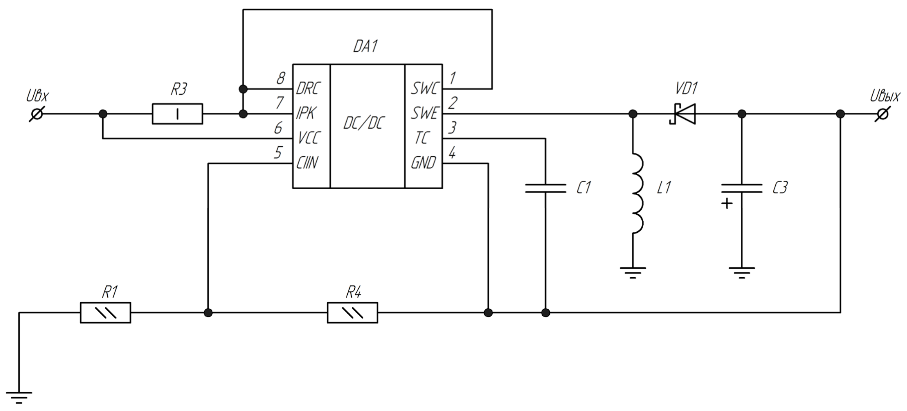
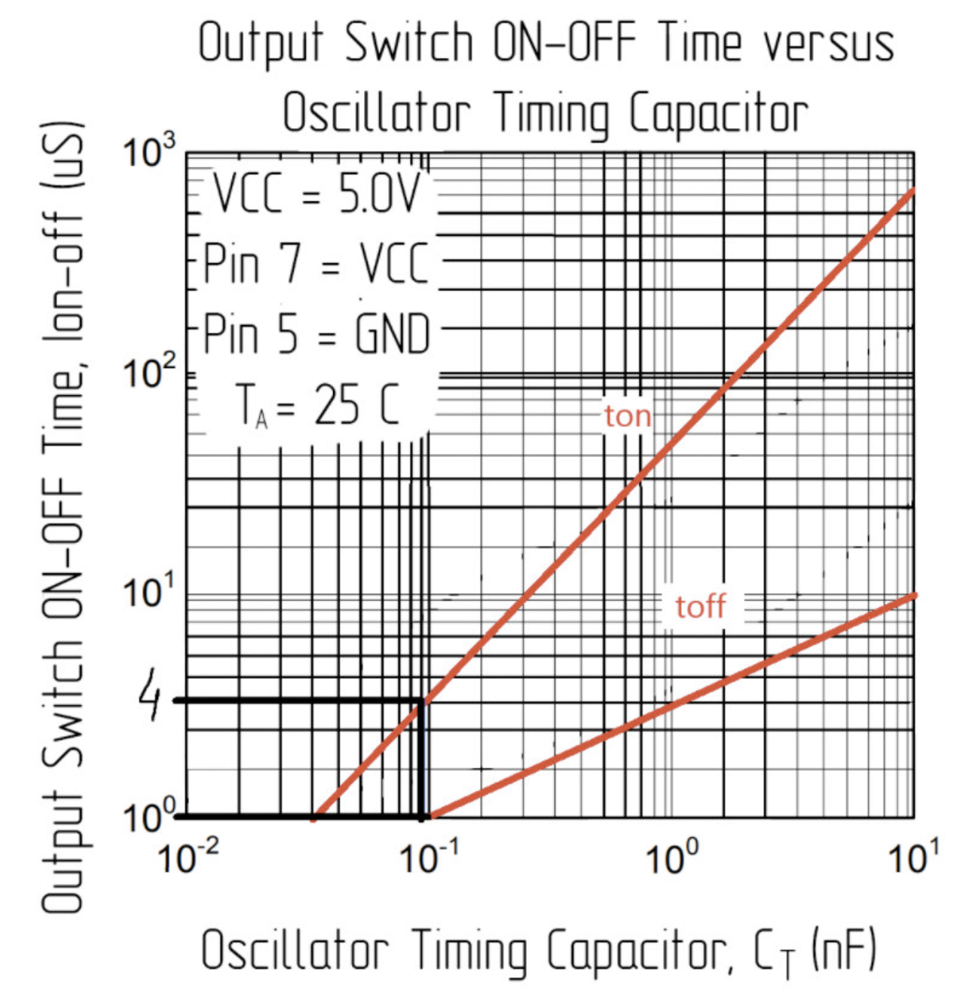
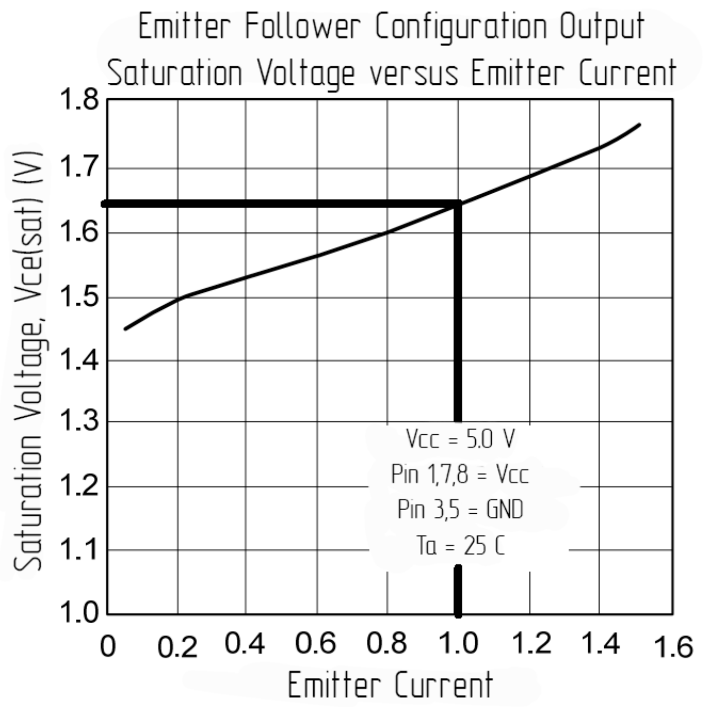
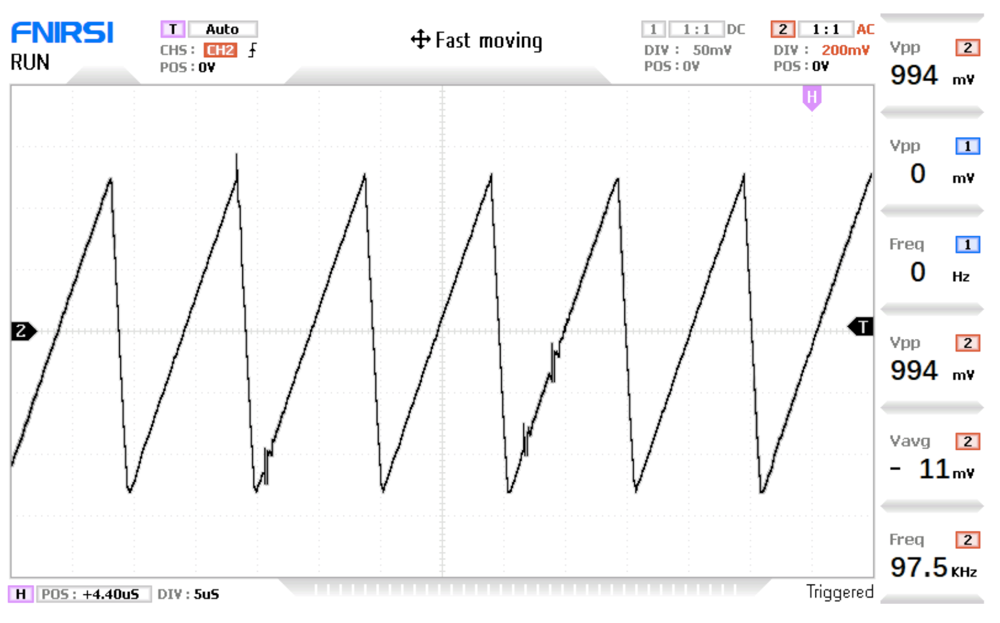
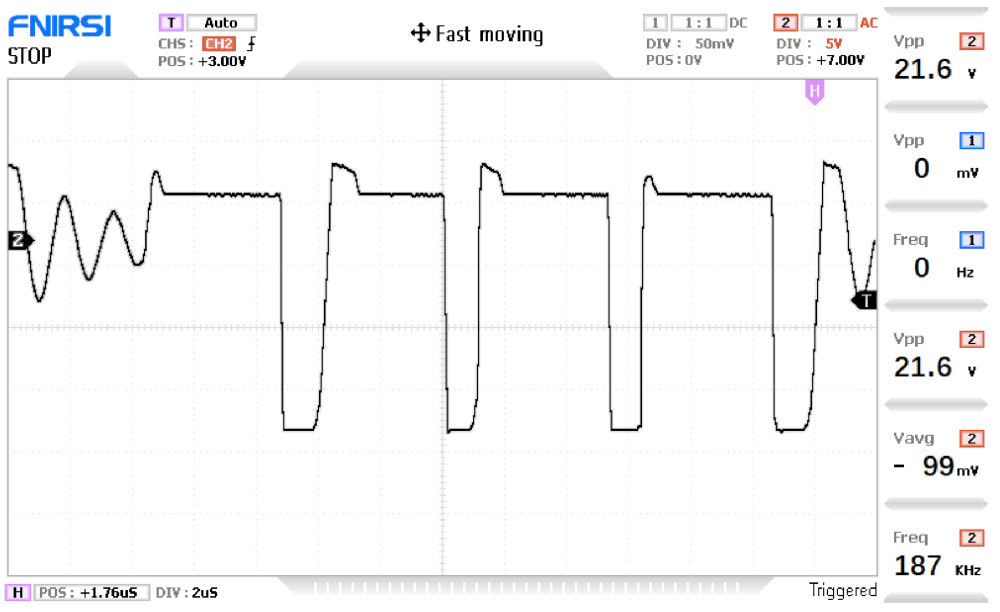

  <a href="README.md">Русский</a> | <b>English</b> | <a href="README.de.md">Deutsch</a>

# Electrical Calculation & Verification of the -15 V Inverter

This section presents a detailed calculation of the external components for the **MC34063AG** switching regulator controller in inverting mode, as well as its physical test results obtained using a digital oscilloscope.

The inverting mode of operation is required to generate a stable negative voltage of $-15\text{ V}$, which is used for the dual-polarity supply of analog sections (operational amplifiers, comparators) on a solderless breadboard.

---

## 1. Schematic Diagram of the Block

The theoretical connection diagram of the IC in inverting mode is presented below:

### Initial Parameters for Calculation:
* Maximum input voltage: $U_{\text{in(max)}} = 20\text{ V}$ (corresponds to the maximum USB Power Delivery profile)
* Nominal input voltage: $U_{\text{in}} = 5\text{ V}$
* Required output voltage: $U_{\text{out}} = -15\text{ V}$
* Maximum output current: $I_{\text{out}} = 100\text{ mA}$
* Allowable output ripple voltage: $U_{\text{ripple(peak-to-peak)}} = 10\text{ mV}$

---

## 2. Theoretical Calculation of External Components

### 2.1. Time Intervals and Frequency Selection
The operating frequency of the internal oscillator is set by the capacitance of capacitor $C_1$ (connected between the `TC` pin and ground). To ensure a compact device design and reduce inductor dimensions, a high switching frequency is chosen.

Based on the datasheet plot, for a capacitor value of $C_1 = 100\text{ pF}$, the following time intervals are selected:
* Output switch conduction interval: $t_{\text{on}} = 4\ \mu\text{s}$
* Output switch turn-off interval: $t_{\text{off}} = 1\ \mu\text{s}$

  

  
### 2.2. Inductor Saturation Current Calculation ($I_{\text{sat}}$)
The saturation current of the inductor $L_1$ is calculated using the following formula:

$$I_{\text{sat}} = 2 \cdot I_{\text{out(max)}} \cdot \frac{t_{\text{on}} + t_{\text{off}}}{t_{\text{off}}}$$

Substituting the values:

$$I_{\text{sat}} = 2 \cdot 0.1 \cdot \frac{4 \cdot 10^{-6} + 1 \cdot 10^{-6}}{1 \cdot 10^{-6}} = 1\text{ A}$$

### 2.3. Minimum Inductor Inductance Calculation ($L_{\text{min}}$)
The minimum inductance is calculated for the worst-case scenario (at maximum input voltage):

$$L_{\text{min}} = \left( \frac{U_{\text{in(max)}} - U_{\text{out(sat)}}}{I_{\text{sat}}} \right) \cdot t_{\text{on(max)}}$$

Where $U_{\text{out(sat)}}$ is the saturation voltage of the internal output transistor of the IC at a current of $1\text{ A}$. According to the datasheet reference plot, this value is $1.65\text{ V}$:

  

  
Calculating the inductance value:

$$L_{\text{min}} = \left( \frac{20 - 1.65}{1} \right) \cdot 4 \cdot 10^{-6} \approx 73\ \mu\text{H}\ (73\ \mu\text{H})$$

*Component selection:* To increase reliability, reduce ripple, and ensure continuous conduction mode, a standard inductor value of **$220\ \mu\text{H}$** was chosen (model *SPQ105-560M* / *B82464G4224M*).

### 2.4. Current Limit Resistor Calculation ($R_3$)
Resistor $R_3$ (connected to the `IPK` pin) protects the IC from overcurrent:

$$R_3 = \frac{0.3}{I_{\text{sat}}} = \frac{0.3}{1} = 0.3\ \Omega\ (0.3\ \Omega)$$

*Value selection:* A standard low-resistance resistor of **$0.22\ \Omega$** (or $0.3\ \Omega$) was chosen.

### 2.5. Output Filter Capacitor Calculation ($C_3$)
The capacitance of the output filter capacitor $C_3$ (designated as $C_1$ in the original thesis formulas) is calculated as follows:

$$C_3 = \frac{I_{\text{out}} \cdot t_{\text{on}}}{U_{\text{ripple(peak-to-peak)}}} = \frac{0.1 \cdot 4 \cdot 10^{-6}}{10 \cdot 10^{-3}} = 40\ \mu\text{F}\ (40\ \mu\text{F})$$

*Component selection:* A tantalum capacitor with a capacitance of **$47\ \mu\text{F}$** (CASE-D type) was chosen from the E12 standard series.

### 2.6. Theoretical Calculation of the Feedback Divider ($R_1$, $R_4$)
An internal comparator with a $1.25\text{ V}$ reference voltage is used to stabilize the output voltage at $-15\text{ V}$. The theoretical calculation at a divider current of $I_{\text{div}} = 1\text{ mA}$ yields the following formulas:

$$R_1 = \frac{|U_{\text{out}}| - 1.25}{I_{\text{div}}} = \frac{15 - 1.25}{0.001} = 13750\ \Omega\ (13.75\text{ k}\Omega)$$

$$R_4 = \frac{1.25}{I_{\text{div}}} = \frac{1.25}{0.001} = 1250\ \Omega\ (1.25\text{ k}\Omega)$$

*Theoretical selection from the E24 series:* $R_1 = 13\text{ k}\Omega$, $R_4 = 1.2\text{ k}\Omega$.

---

## 3. Practical Prototype Debugging (Important!)

During assembly and the initial power-up of the physical prototype, it was discovered that the theoretical feedback and control circuit values required adjustment due to real-world component voltage drops and parasitic parameters. 

### Changes Implemented in the Final Version (v5):
1. **MC34063 Feedback Divider:** To obtain a precise and stable $-15\text{ V}$ level on the physical board, a resistor divider consisting of **$R_4 = 910\ \Omega$** and **$R_1 = 10\text{ k}\Omega$** (with a sequential trim element $R_5 = 750\ \Omega$) was experimentally installed. This compensated for the voltage drop across the Schottky rectifier diode $VD_1$ and ensured stable generation of the negative rail.
2. **CH224K Pull-up Resistors:** In the configuration circuits `CFG1–CFG3` of the fast-charging trigger, the resistor values were changed from **$1\text{ k}\Omega$ to $10\text{ k}\Omega$**. The excessively low value of $1\text{ k}\Omega$ prevented the IC from correctly switching logic levels to request the required voltage profile from the wall adapter.

---

## 4. Physical Measurement Results (Verification)

To confirm the stability of the circuit, oscilloscope signal registration was performed at key points of the device.

### 4.1. Waveform across Frequency-Setting Capacitor $C_1$
The actual operating frequency of the internal generator was **$97.5\text{ kHz}$** (with a calculated maximum of $100\text{ kHz}$ for this IC). The voltage waveform is a classic sawtooth without distortion, confirming the stability of the internal oscillator.

  

### 4.2. Waveform across Inductor $L_1$
Measurement at the switch node (pin `SWE` / anode of diode `VD1`) confirms the converter is operating in the calculated switching mode. The conduction interval is $4\ \mu\text{s}$, and the turn-off interval is $1\ \mu\text{s}$, which is fully consistent with the calculated timing. High-frequency oscillations (ringing) present during switching are within acceptable limits for the selected Schottky diode $15MQ040N$.

  

---

## 5. Comparison of Calculated and Experimental Data

| Parameter | Calculated Value | Actual (Prototype) | Verification Status |
| :--- | :---: | :---: | :--- |
| **Output Voltage ($U_{\text{out}}$)** | -14.57 V | -15.02 V | **Passed** (accuracy ≈ 3%) |
| **Operating Frequency ($f$)** | 100 kHz (max) | 97.5 kHz | **Passed** (optimal for MC34063) |
| **Conduction Time ($t_{\text{on}}$)** | 4.0 µs | 4.0 µs | **Passed** (exact match) |
| **Turn-off Time ($t_{\text{off}}$)** | 1.0 µs | 1.0 µs | **Passed** (exact match) |
| **Ripple Amplitude (peak-to-peak)** | < 100 mV | ≈ 85 mV | **Passed** (within margins for breadboards) |
